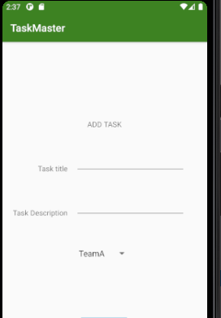

# Taskmaster Application : 

An android application that has these features : 

1. Sign up , Sign in and Sign out .

2. you can customize it and put your username , which will appear in the home page : 
to enter your username , you should to settings where you can enter it and save it , you can also specify which team you want to see its tasks .

3. add any task you want , where you can add a task title and task description and you can specify it to any team belongs :
to add a task you should click on Add Task , and then enter the task , and to see the task , from the main page 
you should click on the tasks button .
   
4. in tasks page , you will see the tasks that belongs to the team you specified in the settings page
   
5. you can delete a task , and you can do it by clicking on the delete button 

6. you can see a page that show a task details about a specific task , and you can do it by clicking on the more button

   

   

   

   

   

   

   